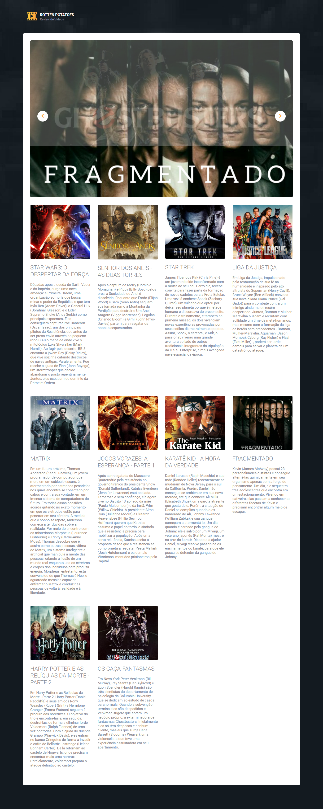

# Desafio 07 - Projeto rotten-potatoes

O projeto rotten-potatoes é uma aplicação escrita em Python e tem como objetivo ser uma aplicação de exemplo pra trabalhar com o uso de containers.

## Requisitos do Projeto:

Antes de começar, você vai precisar ter instalado em sua máquina os seguintes recursos:

- [Git](https://git-scm.com/downloads)
- [Docker](https://docs.docker.com/get-docker/)

## Executando o Projeto:

Para testarmos a aplicação, temos que executar os passos a seguir:

1. [Fazer download do Projeto](#download-github)
2. [Executar Docker Compose](#docker-compose)
3. [Acessar a Aplicação](#acessando-app)

<a name="download-github"></a>
### 1. Fazer download do Projeto:
 1. Baixe este Repositório, executando o comando Git:
```bash
git clone https://github.com/leandroph/DevOpsPro-Desafios.git
```

<a name="docker-compose"></a>
### 1. Fazer downloa do do Projeto:
1. Acesar o diretório `Desafio_07/rotten-potatoes/src`, executar o compando:
```bash
docker compose up -d
```

<a name="acessando-app"></a>
### 3. Acessar a Aplicação do Redis Commander:

1. Em seu navegador, de sua preferência, acesse a url `http://localhost:5000` para visualizar a Aplicação;

2. Se os passos anteriores foram executados corretamente, a resposta será semelhante a tela abaixo:



